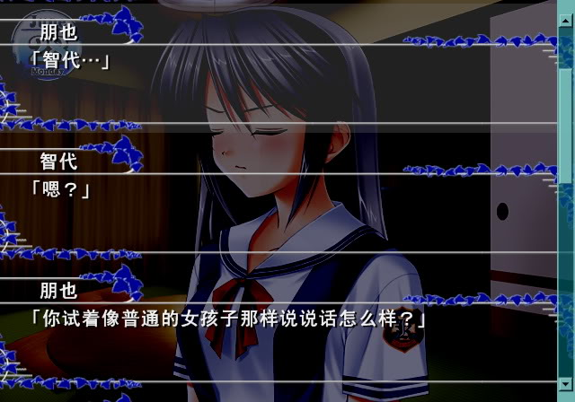
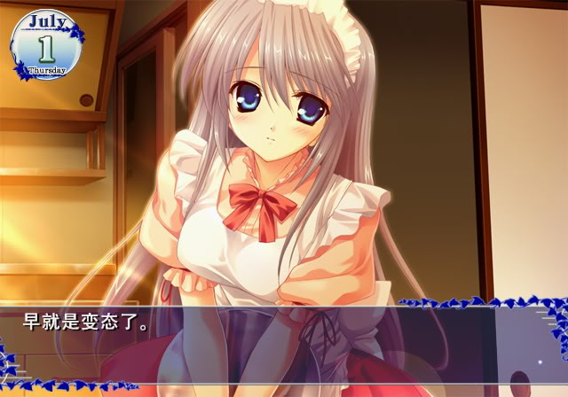

http://bbs.sumisora.org/read.php?tid=10902367

听着歌曲又泪目了 TAT

智代After(PS2版)汉化补丁 v0.6
制作苦力们：
aya.freeshift.jxyy99.kid.nekoneko

补丁说明：
1.汉化游戏文本部分。
2.图片部分只汉化了部分。
3.可选择是否安装程序补丁。打了程序补丁后使用模拟器玩选择硬件模拟会花屏，软件模拟正常，原因未知。若不安装程序补丁文件，则可用模拟器硬件模拟，但中文人名无法显示，RPG部分乱码。
4.此补丁适合原版镜像和去dummy版镜像。

使用方法：
1.使用前请先自行备份镜像文件。
2.运行程序选择镜像文件，确认文件非只读、可写，就ok了。

提前放出，庆祝这个游戏繁多的12月和即将到来的psp版智代，也当作圣诞节前的礼物，对智代、PS2还有爱的收吧。圣诞那天有妹的推妹，没妹的推智代去（被TF。。。）

这坑也拖了很久了，看了下时间，脚本早在08年初就解出来了，不过这一年很黄很暴力，也很忙，一直没空弄完，直到11月才把程序部分写完。技术上倒也没啥难的，不过很烦琐。本来是准备做个完整版的，无奈某万能的苦力王、坑神、改图大仙（省略修饰词n的n次方个……）回老家结婚去了（误，拖。。），没人整理改图了，所以图片只汉化了部分，偶又实在懒的再写程序弄了，大家将就吧。。

2008-12-22 23:13

