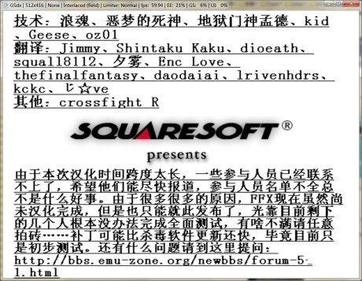

FFX压缩算法和镜像重组工具。
当年留了个坑，某类型文件压缩算法没写完整，导致个别特定文件出错，时间一长大家都忘了==以为是翻译、汉化时出的问题。后来Lonwern改进了下压缩性能

FFX Algorithm v0.4 by kid 2006.12.16

'ffx.exe e file1 file2' encodes file1 into file2.
'ffx.exe d file2 file1' decodes file2 into file1.
